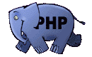

### Laravel Backend Basic Package For Project

This project has implement DDD ( Domain Driven  Design )
> ### SOLID Principles of Object-Oriented Design
> - Singleton 
> - Open/Closed
> - Interface 
> - Factory
> - Repository 
> - Service

### Dependencies
| Name           | Features                              | Status | Version |
|----------------|---------------------------------------|--------|---------|
| Laravel        | Main Framework                        | stable | 9.x     |
| Authentication | Sanctum Authentication                | stable | 3.x     |
| Spatie         | Role & Permission Management          | stable | 5.x.x   |
| Swagger UI     | Documentation OpenAPI                 | stable | 8.x     |
| Log Viewer     | Log Viewer For Error Handling Backend | stable | 8.x     |

###  Coding Style Guidelines and Best Practices

   - https://dev.to/lathindu1/laravel-best-practice-coding-standards-part-01-304l

### Open API Specification Code Documentation

The api can now be accessed at

    http://localhost:8080/api/documentation

### Log Viewer 

The log can now be accessed at

    http://localhost:8080/log-viewer

### Current Basic Features
- Sample CRUD
- Swagger UI
- Logger UI Management
- Authentication
- Role Management
- API Exception
- Laravel Sail with Docker All In One Application Package

### Run the application
the application can run with these command, make sure PHP > 8.1 installed :

first install dependency dev

    composer install && composer update

and then running the app

    php artisan serve

you can access the web using :

    http://localhost:8000

